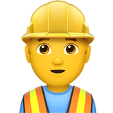

import { Head, Notes } from 'mdx-deck'
import { Split } from 'mdx-deck/layouts'

import Timeline from './components/timeline/timeline'
import Quote from './components/quote'
import Wrapper from './components/wrapper'

<Head>
  <title>Testing</title>
</Head>

<!-- Presentation start -->

# Testing Webapps 🧐

💪 Getting motivated 💪

---

export default Split

## Hendrik

Developer for fun 🎉

---

export default Split

## Testing

- Find bugs before users do
- Ensure we fulfil specification

Timeinvestment

<Notes>
  Examples to show why how we test is important
</Notes>

---

## Legend

 Meetings

 Work on product

 Manual testing

 Releasing software

<Notes>
  Most people meet every two weeks.
  Because "scrum" or "agile".
</Notes>

---

## Codefreeze

import longTestingData from './scenarios/longTesting'

<Wrapper>
  <Timeline
    data={longTestingData}
  />
</Wrapper>

---

## More Releases

import splitTestingData from './scenarios/splitTesting'

<Wrapper>
  <Timeline
    data={splitTestingData}
  />
</Wrapper>

--- 

| Dev | Test | Meet | Releasing | Releases |
| --- | --- | --- | --- | --- |
| 11 | 5 | 2 | 1 | 1 |
| 14 | 2 | 2 | 2 | 8 |

---

| Dev | Test | Meet | Releasing | Releases | Bugs |
| --- | --- | --- | --- | --- | --- |
| 11 | 5 | 2 | 1 | 1 | 🐛🐛🐛 | 
| 14 | 2 | 2 | 2 | 8 | 🐛 | 

---

<Quote size="3">
IT IS ALL ABOUT CYCLES
</Quote>

---

## High performing organizations.

---

## Perfect day

---

## My dream 🤩

import perfectTestingData from './scenarios/perfect'

<Wrapper>
  <Timeline
    data={perfectTestingData}
  />
</Wrapper>

---

explain a perfect day
only automation can get us here

---

Testing using cypress

---

